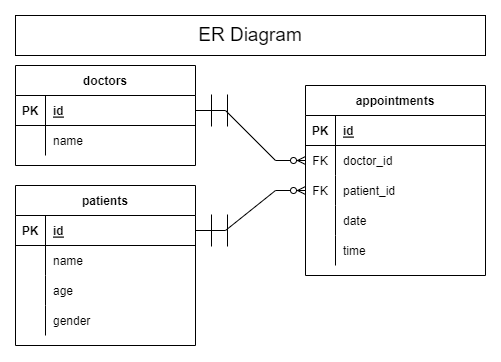

# Appointment System App

This application is built with a ReactJS frontend client, Express.js backend API server and PostgreSQL database. Docker Compose was used to orchestrate the different services for development and deployment.

## Installation
### Using Docker Compose

With [Docker Compose](https://docs.docker.com/compose/install/), you can run this whole project with just one command.
> docker-compose up

Docker compose will then spin up 3 containers.
1. client: ReactJS frontend
1. server: Express.js backend API server
1. postgres: PostgreSQL database

You can access the application at your browser at
> http://localhost:3000

## Entities and relations
