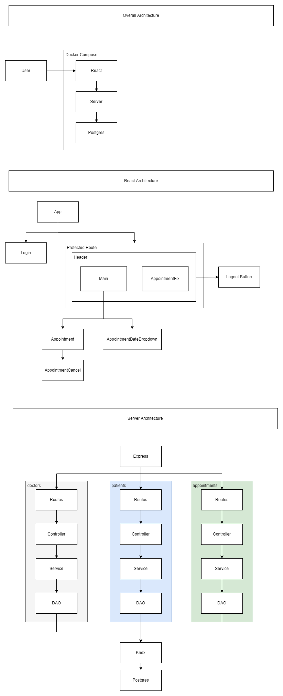

# Appointment System App

This application is built with a ReactJS frontend client, Express.js backend API server and PostgreSQL database. Docker Compose was used to orchestrate the different services for development and deployment.

## Installation
### Using Docker Compose
With [Docker Compose](https://docs.docker.com/compose/install/), you can run this whole project with  just one command.

First clone this repository, and in the root folder(e.g where the file titled "docker-compose.yml" is located), run the command
> docker-compose up

Docker compose will then spin up 3 containers.
1. client: ReactJS frontend
1. server: Express.js backend API server
1. postgres: PostgreSQL database

You can access the application at your browser at
> http://localhost:3000

## Entities and relations

## Application Architecture

## Assumptions
- There are only two types of users for this app, doctors and patients.
- To login, only the ID and NAME is required.
- Doctors and patients can both use this booking application, but only doctors have the option to sort their appointments by date, as they would have many appointments booked, but typically for patients they will not have multiple appointments booked at the same time.
- To fix an appointment, it will require both patient and doctor's schedules to be free for the corresponding date and time.
- A user cannot fix appointments for other users of the same type, e.g doctors cannot fix appointment for other doctors but can fix appointments with different patients, and patients cannot fix appointments for other patients, but can fix appointment with different doctors.
- At the main page, doctors will be able to see the patient's name, age and gender for each appointment, but patients will only see the doctor's name

## NOTE
When running this application for the first time, you might encounter this message
> server_1    | bash: line 1: /dev/tcp/postgres/5432: Connection refused

This occurs because the PostgreSQL database service takes some time to initialize and build the necessary files. If you see this message printing continously on the console, it means that the server service is trying to establish a connection with the PostgreSQL service. Give the application a few minutes to complete the initialization of the PostgreSQL service.
